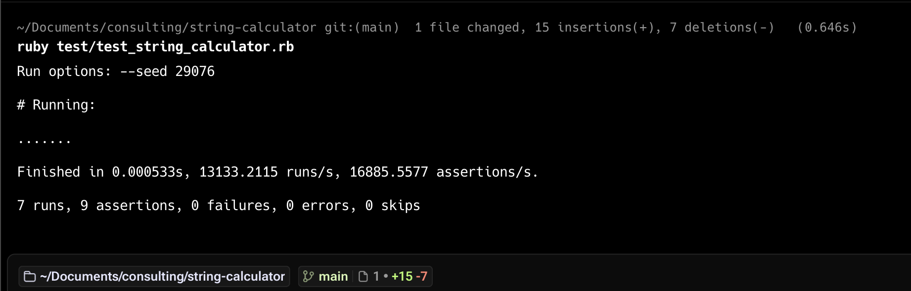

# String Calculator TDD Kata


This is an implementation of the String Calculator TDD in Ruby using Minitest.

## Getting Started

### Prerequisites
- Ruby 3.2.1 (managed via rbenv/rvm - see `.ruby-version`)
- Bundler gem

### Setup
```bash
# Using rbenv
rbenv install 3.2.1
rbenv local 3.2.1

# Using rvm
rvm install 3.2.1
rvm use 3.2.1

# Install dependencies
bundle install
```

### Running Tests
```bash
ruby test/test_string_calculator.rb
```

## Test Results



*All tests passing - demonstrating successful TDD implementation with 7 test cases and 9 assertions*

## TDD Progress

Following the TDD Red-Green-Refactor cycle for each requirement:

- [x] Empty string returns 0
- [x] Single number returns that number  
- [x] Two numbers return their sum
- [x] Handle any amount of numbers
- [x] Handle newlines between numbers
- [x] Support custom delimiters
- [x] Throw exception for negative numbers

## Project Structure

```
string-calculator/
|-- lib/
│   |-- string_calculator.rb    # Main implementation
|-- test/
│   |-- test_string_calculator.rb  # Test cases
|-- README.md                   
```


|
|